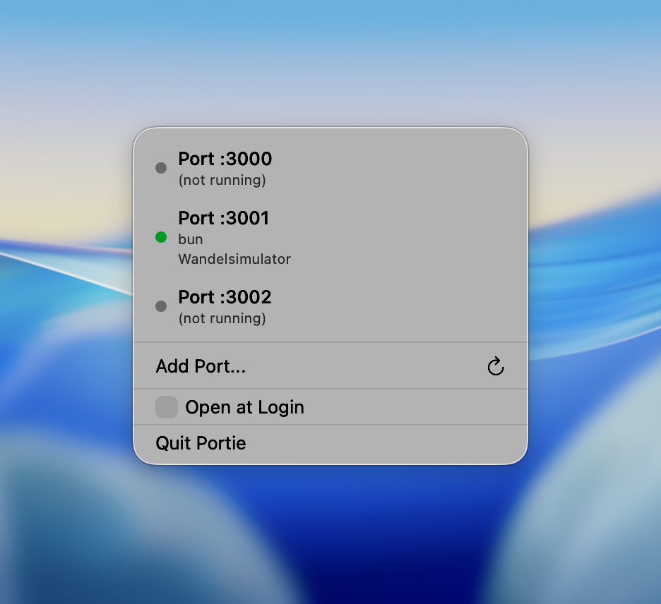

# Portie

A macOS menu bar app that monitors localhost ports for developers.

## Download

Download the latest version from [Releases](https://github.com/TimBroddin/portie/releases).

## Features

- **Manual port list** - Add specific ports to monitor
- **Port discovery** - Automatically discovers open ports on your machine
- **Live status** - Shows process name and page title (e.g., "node · My Next App")
- **Badge count** - Menu bar icon shows number of active ports
- **Quick actions** - Kill processes or open in browser with one click
- **Auto refresh** - 15-second polling with manual refresh option
- **Portless integration** - Friendly localhost URLs via [Portless](https://github.com/nichochar/portless) proxy

## Screenshot

## Requirements

- macOS 14.0+
- Xcode 15+

## Building

Open `Portie.xcodeproj` in Xcode and build (⌘B).

## License

MIT
